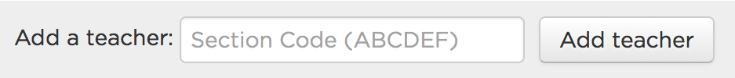

##Code.org Sign Up

Before completing the HWs, visit [code.org](code.org) and create an account. Share your progress with me by:

 - Visiting [http://learn.code.org/join/MERBDM](http://learn.code.org/join/MERBDM), **OR**
 - adding the teacher code “MERBDM” by clicking the link at the bottom of the progress page.
 
To access to progress page, go to the upper right, click on your name and select “My progress”. At the bottom, you should see a box that looks like this:

 