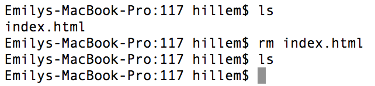

# Practice WOD2: UNIX Command Overview

For each of the following commands:

A. Briefly describe what it does in your own words. Example: 

    wget downloads files from the internet

B. Write a template of how the command is used -- indicate arguments in [brackets]. For example, a template for the wget command would look like this:

    wget [url to download]

C. Take a screenshot of using the command on your terminal (please crop irrelevant parts<!--, but make sure to show your prompt so I can see it’s your computer and not someone else’s)-->. You should make sure the command works in the screen shot.

   Example for **wget**:

   

   Example for **remove** needs to show the file is no longer there:

   

Your document should be organized by command -- for example, you should describe the ls command, give its template, and include a cropped screenshot before moving on to the next command, pwd.

**Commands:**

1. ls
1. pwd
1. cd
1. touch
1. mkdir
1. cp
1. mv
1. rm
1. ped
1. cat
1. zip    
1.  .      (not a command, use in conjunction with another command)
1. ..      (not a command, use in conjunction with another command)
1. tab     (no screenshot necessary)
1.  ↑      (no screenshot necessary)

**How to take *& crop* a Screenshot**

- Windows: [www.ehow.com/how_6801557_crop-screen-shot.html](www.ehow.com/how_6801557_crop-screen-shot.html)
- Mac: [http://www.ehow.com/how_4559274_take-edit-screen-shots-mac.html](http://www.ehow.com/how_4559274_take-edit-screen-shots-mac.html)
    - Make sure to use Command (⌘)-K rather than control-K as the article states.

<!--

## Demonstration

Once you've finished doing the WOD a single time, watch me do it:



-->