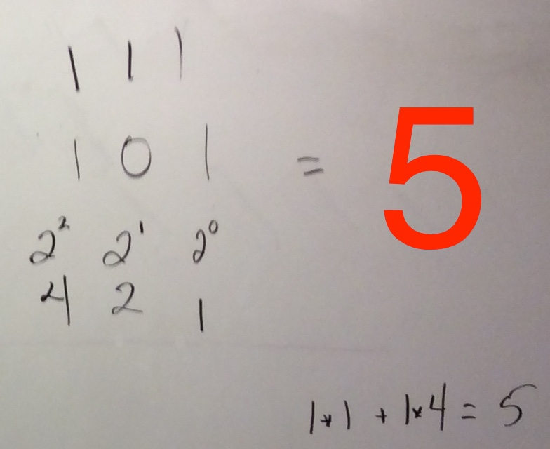

<!--morea_url: /morea/02.OO-intro/board_notes.JPG-->

# Board Notes 1/30

## Converting Binary to Decimal

Calculating the value of a decimal number with powers of ten:

 

Using that same technique to convert from binary to decimal with the powers of two:

 

Write out the binary number. Then, underneath each digit, write a power of 2 increasing from left to right. Always start with the 1's position first and work your way right. Wherever you see a 1, add the value for that power of two.

The same trick for a bigger binary number (54 in decimal):

 

## Converting Decimal to Binary

To convert decimal to binary, you apply the same technique in reverse:

 

Write down all the powers of two from right to left. Find the largest power of 2 that is less than the decimal number you want to convert and place a 1 above it. For example, the largest power of 2 that fits inside 37 is 32. Next, find the difference between these two numbers (in this example, 5). Now convert that decimal to binary using the same technique. The largest power of 2 that fits into 5 is 4, so we place a 1. We still need 1 more, so we place a 1 above the 1 spot. All the remaining spots get filled in with 0's.