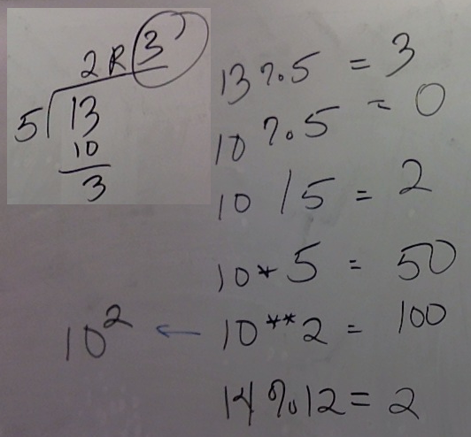

<!--morea_url: /morea/02.OO-intro/board_notes.JPG-->

# Board & Demo Notes 2/6 & 2/9

## Python arithmetic

Python supports 6 basic arithmetic operations:

 * addition (+)
 * subtraction (-)
 * multiplication (*)
 * division (/)
 * exponent (**)
 * remainder or modulus (%)

Below are some examples we looked at in class:
 

## Example program(s) from 2/8

 * [arith_and_assign.py](arith_and_assign.py)
 * [input_demo.py](input_demo.py)
 