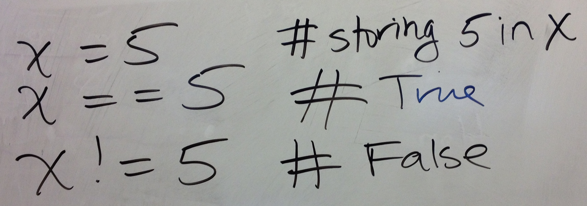

# Board & Demo Notes

## Python Boolean Comparison Operators

Regarding order of operations & precedence: 
 

Examples with equals: 
 

## Example program(s) 

### from 2/13

 * [if.py](if.py)
 * Original [dow.py](dow.py)
 * Modified [dow.py](dow-inclass.py) from class -- we used the built-in [rstrip](https://docs.python.org/3.3/library/stdtypes.html?highlight=upper#str.rstrip) function

### from 2/16

 * [range_examples.py](range_examples.py)