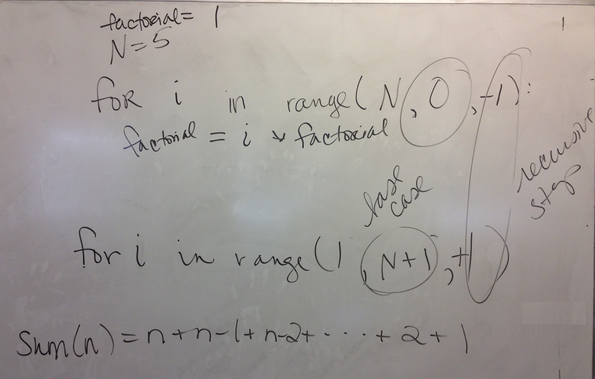

# Board & Demo Notes

 

**The stages of python learning:**

1. Can you predict what a program will do/output?
2. Can you change an existing program to do something similar?
3. Write a program from scratch, given a description of what it should do.
 

## Examples from 2/20 & 2/23

 * [functions.py](functions.py)
 * [my_fun.py](my_fun.py)
 * [flow.py](flow.py)
 * [dbl.py](dbl.py)
 * [add.py](add.py)

`h(4)` in flow.py: 
 

## Examples from 2/27 
 * [factorial.py](factorial.py)
 * [sum.py](sum.py)
 

Iterative solution to factorial using a loop:

Manual walk thru of factorial using a recursive solution:

Call sequence of infinite recursion (not reducing recursive step to the base case):

Solutions to the `sum` practice problem:

