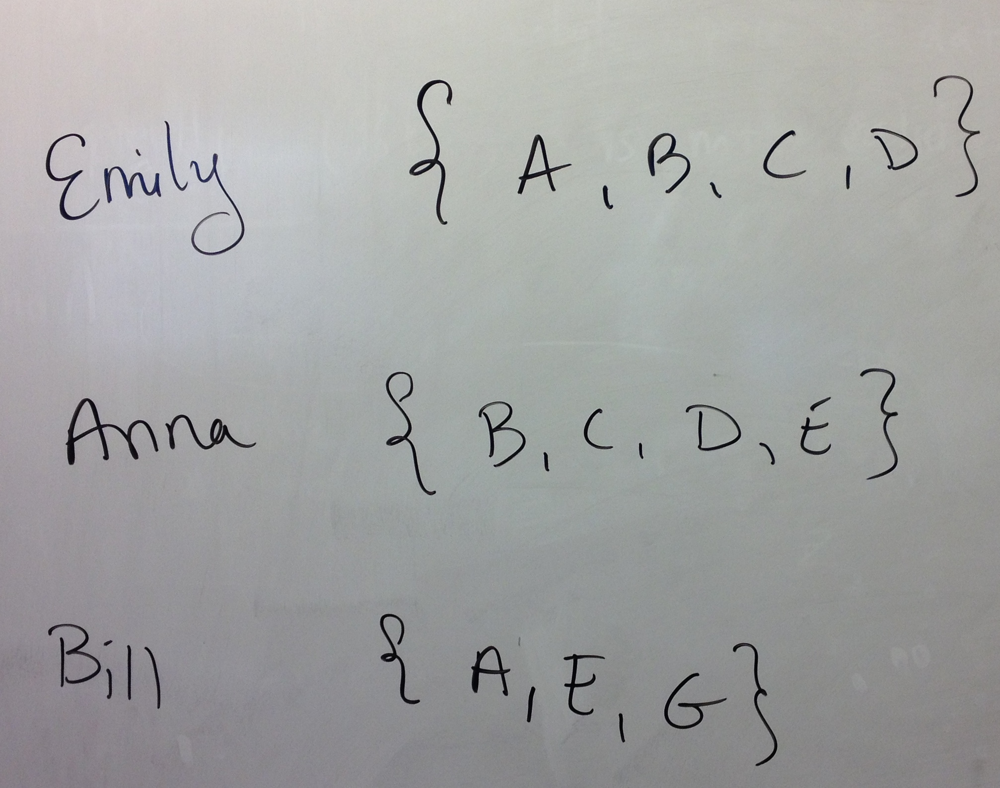
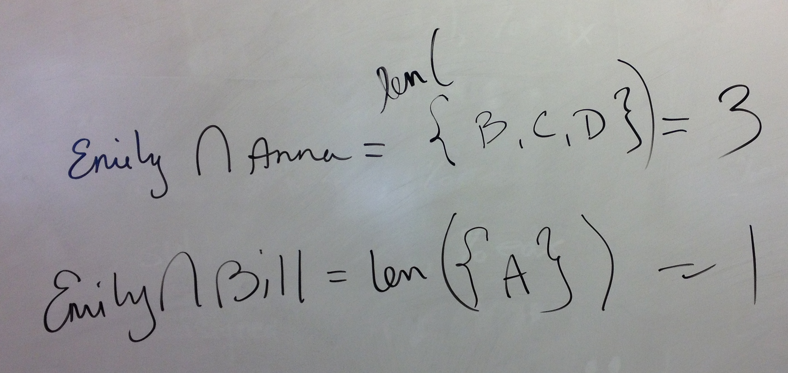
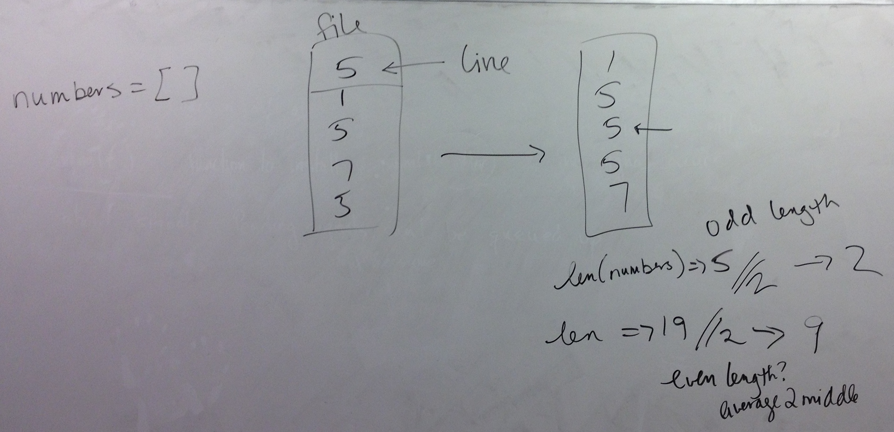
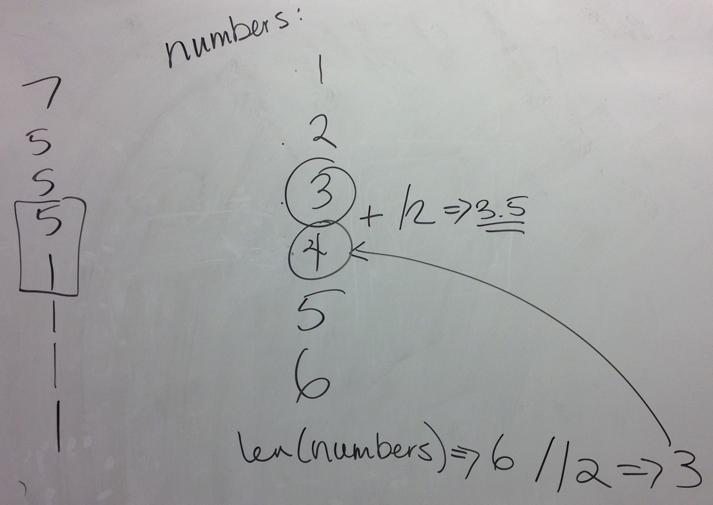

# Board & Demo Notes

## In class 4/6

 * [csv_reader.py](in_class/csv_reader.py)
 * [harry_potter.csv](in_class/harry_potter.csv)

Sets of friends:

Given the friend sets above, who should we recommend as a friend for Emily? Anna or Bill?

## In class 4/17

	def mean(numbers):
		return sum(numbers) / len(numbers)
	
	
	#numbers = list(range(1,11))
	numbers = []
	file = open("numbers.txt")
	for line in file:
		numbers.append(eval(line))
	file.close()
	
	print(numbers)
	print("Mean: ", mean(numbers) )

## Median hints:

	
## In class 4/20	
		
	def mean(numbers):
		return sum(numbers) / len(numbers)
	
	def median(numbers):
		sorted_num = sorted(numbers)
		if len(numbers) % 2 == 1: # odd
			return sorted_num[len(numbers) // 2]
		else: # even
			i1 = len(numbers) // 2 
			i2 = i1 - 1
			#print("i1:", i1, "i2", i2, "len:", len(numbers), sorted_num)
			return (sorted_num[i1] + sorted_num[i2]) / 2
	
	def mode(numbers):
		freq = {}
		for n in numbers:
			freq[n] = freq.get(n, 0) + 1
	# 		if n in freq:
	# 			freq[n] += 1
	# 		else:
	# 			freq[n] = 1
		#print(freq)
		mode = 0
		max = 0
		for key in freq:
			# freq.get(key) or freq[key]
			if freq.get(key) > max: 
				max = freq.get(key)
				mode = key
		return mode
	
	#numbers = list(range(1,11))
	numbers = []
	file = open("numbers.txt")
	for line in file:
		numbers.append(eval(line))
	file.close()
	
	print(numbers)
	print("Mean: ", mean(numbers) )
	print("Median: ", median(numbers) )
	print("Mode: ", mode(numbers) )